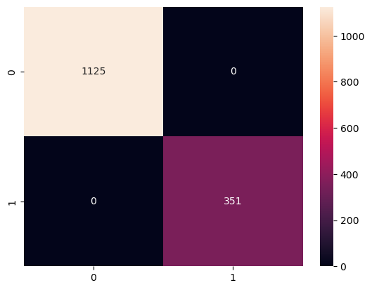

# Model Card

See the [example Google model cards](https://modelcards.withgoogle.com/model-reports) for inspiration. 

## Model Description

**Input:** Describe the inputs of your model 
- The inputs of this dataset contains symptoms of the patient
    - ['Symptom_1', 'Symptom_2', 'Symptom_3', 'Symptom_4',
    'Symptom_5', 'Symptom_6', 'Symptom_7', 'Symptom_8', 'Symptom_9',
    'Symptom_10', 'Symptom_11', 'Symptom_12', 'Symptom_13', 'Symptom_14',
    'Symptom_15', 'Symptom_16', 'Symptom_17']

**Output:** Describe the output(s) of your model
2 model outputs:
- type of disease
- to send to hospital

**Model Architecture:** Describe the model architecture you’ve used
- randomforest (type of disease classification)
- SVM ( to send to hospital )

## Performance

Give a summary graph or metrics of how the model performs. Remember to include how you are measuring the performance and what data you analysed it on. 
From the model, the random forest scored an average precision of 99% on the different type of diseases on the test dataset. For the SVM, it got a 100% accuracy on the test dataset. This may be due to the small sampling size of the dataset and will require more types of diseases to be included to have a better guage in the testing.

Random Forest Model
                               accuracy                           0.99
                              macro avg       0.99      0.99      0.99
                           weighted avg       0.99      0.99      0.99

Support Vector Model Confusion Matrix

## Limitations

Outline the limitations of your model.
- This model can only input up to 132 different unique symptoms and output 40 different diseases only.

## Trade-offs

Outline any trade-offs of your model, such as any circumstances where the model exhibits performance issues. 

- As the dataset expands, both SVM and RandomForest will take a longer time in computation as these models are computationally expensive and also will take a longer time to run due to the hyperparameter tuning function as gridsearch.